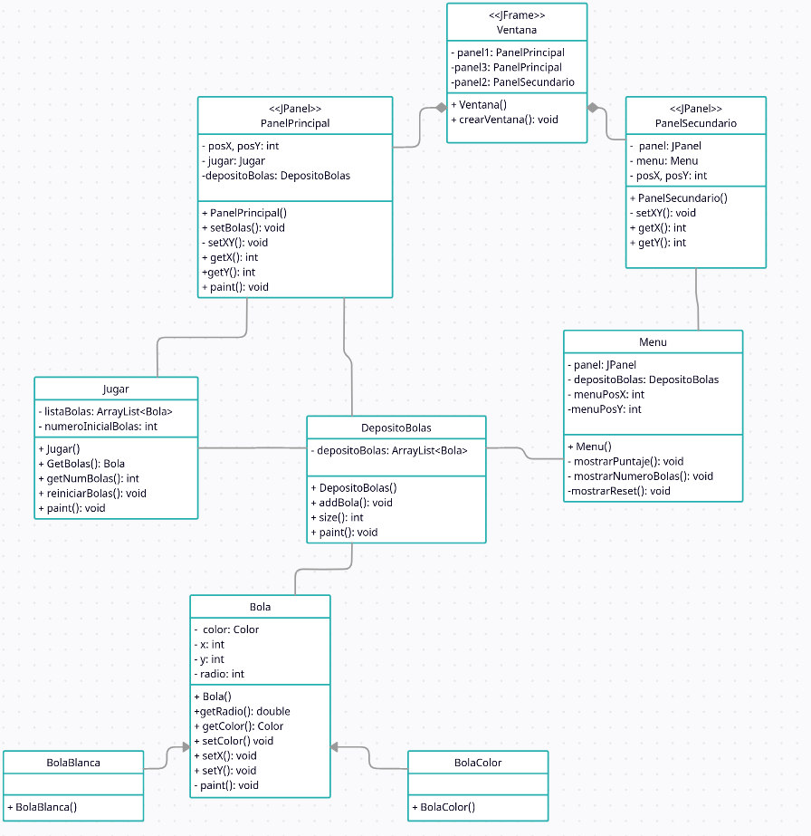

# Proyecto-Semestral-Programacion-II

Repositorio Proyecto S  emestral de la asignatura Programacion 2 S2-22 de la carrera Ingenieria Civil Informatica de la Universidad de Concepcion.

>Fecha de entrega **2 de Diciembre hasta las 23:59.**

## Tema 6: Mesa de pool

  En el panel central, con vista aérea, deben aparecer bolas en posiciones randómicas, una blanca y otras de color. El taco debe aparecer automáticamente apuntando a la bola blanca y debe ser manejado con troles GUI (teclado y mouse), para golpear bola blanca. Las bolas deben tener la física de impactos, inercia y roce.  En las esquinas debe haber troneras donde pueden caer. La cantidad de bolas debe ser definible por interfaz GUI. Habrá bandas para rebote de las bolas y si caen en las troneras, otorgan puntos.  Reiniciar se debe hacer por controles GUI. Si se cae la bola de color y la blanca no hay puntaje, si cae la blanca se resta puntaje.

## Grafico UML

## Autores

- [@PabloSanhueza1](https://github.com/PabloSanhueza1) Pablo Sanhueza Yévenes
- [@TheAmazingLife](https://github.com/TheAmazingLife) Joaquin San Martín Vargas
- [@Kano10](https://github.com/Kano10) Luciano Argomedo Solis
  
<!--  -->
